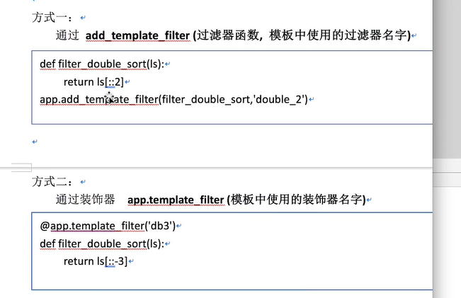

# 模板和过滤器

* 模板

模板可以使用templates文件中的HTML文件来渲染网页

个人理解就。。使用一个新的HTML文件加载在这个网页上，不过可以传值变换网页中的一些内容

示例就demo_model.py文件

* 过滤器

这个可以使用flask自带的过滤器，类型大概在image文件中,一共有四张图片就不一一加载进来了

也可以自定义过滤器demo_model.py文件中有示例

* 自定义过滤器

两种方式

示例就：demo_model.py

* xss攻击

百度百科： XSS攻击通常指的是通过利用网页开发时留下的漏洞，通过巧妙的方法注入恶意指令代码到网页，使用户加载并执行攻击者恶意制造的网页程序。这些恶意网页程序通常是JavaScript，但实际上也可以包括Java、 VBScript、ActiveX、 Flash 或者甚至是普通的HTML。攻击成功后，攻击者可能得到包括但不限于更高的权限（如执行一些操作）、私密网页内容、会话和cookie等各种内容。 

xss文件示例的输入就是普通的HTML代码修改了xss.html中的语句，使其执行一些功能。不过这种一般可以转义解决