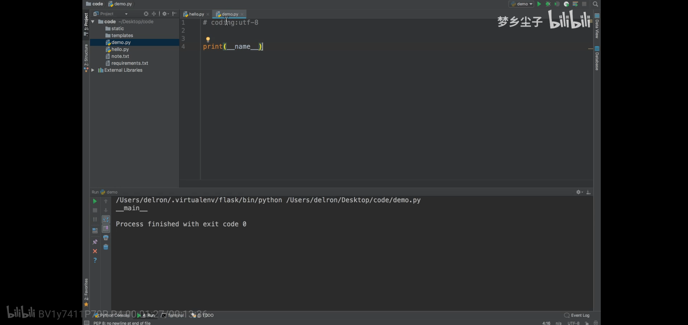
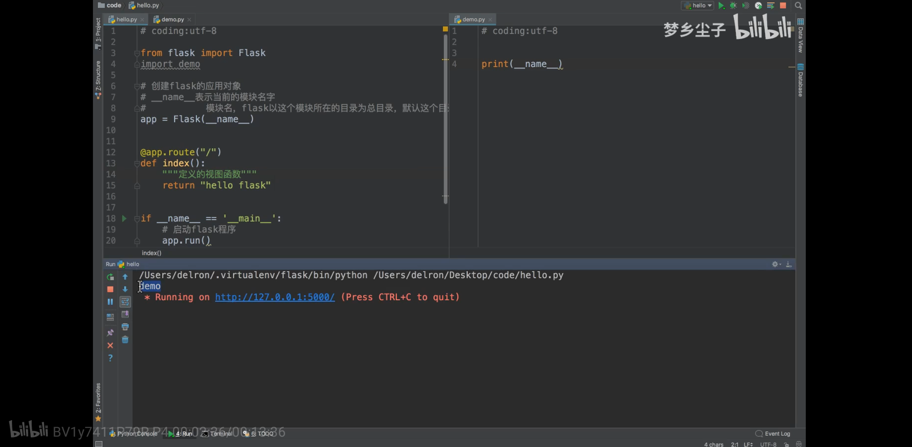

# flask应用对象的初始化参数说明

1. 理解__name__含义

表示的是当前模块，也就是所在py脚本文件。如图

2. flask 创建app参数

* 初始化参数

import name  导入路径（寻找静态目录与模板目录位置的参数）

static_url_path   访问静态资源的url前缀

static_folder   静态文件的目录，默认就是static

template_folder   模板文件的目录，默认是templates
