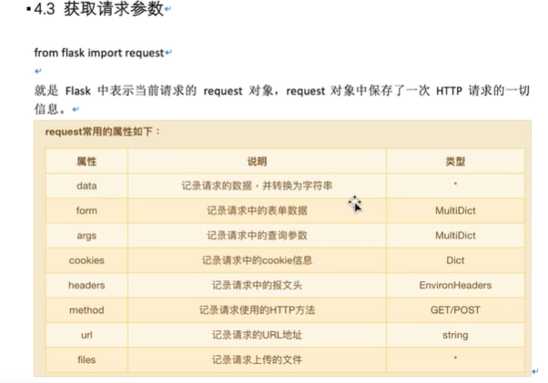
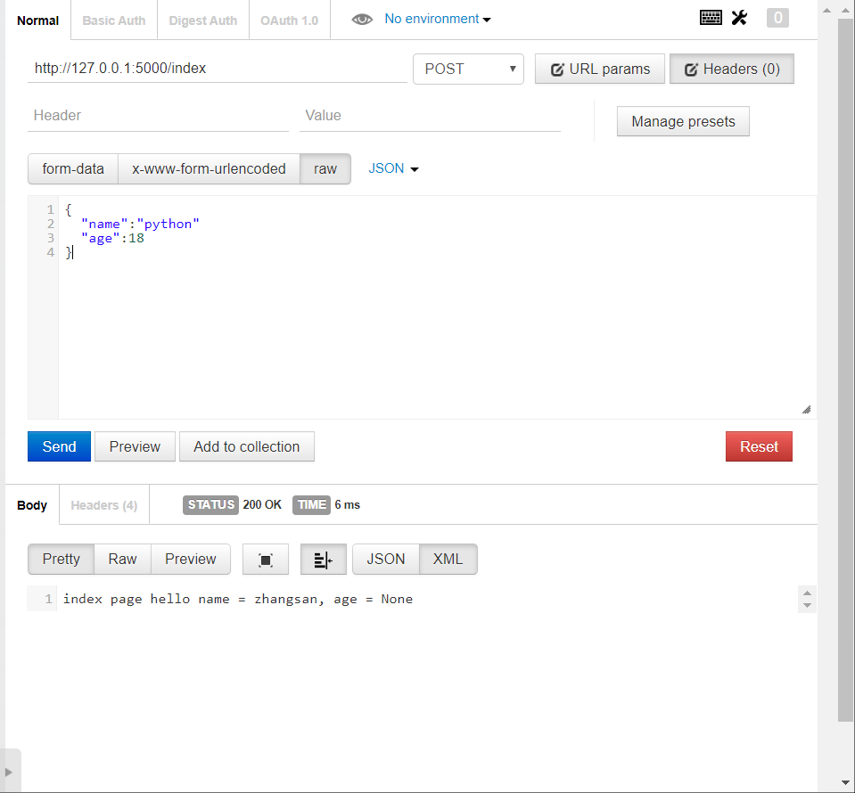
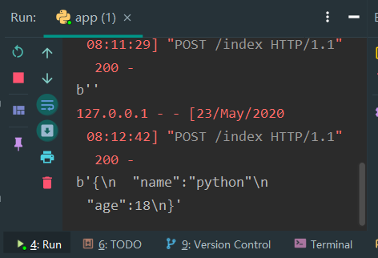
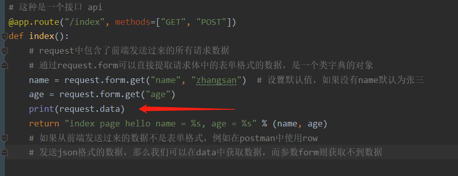
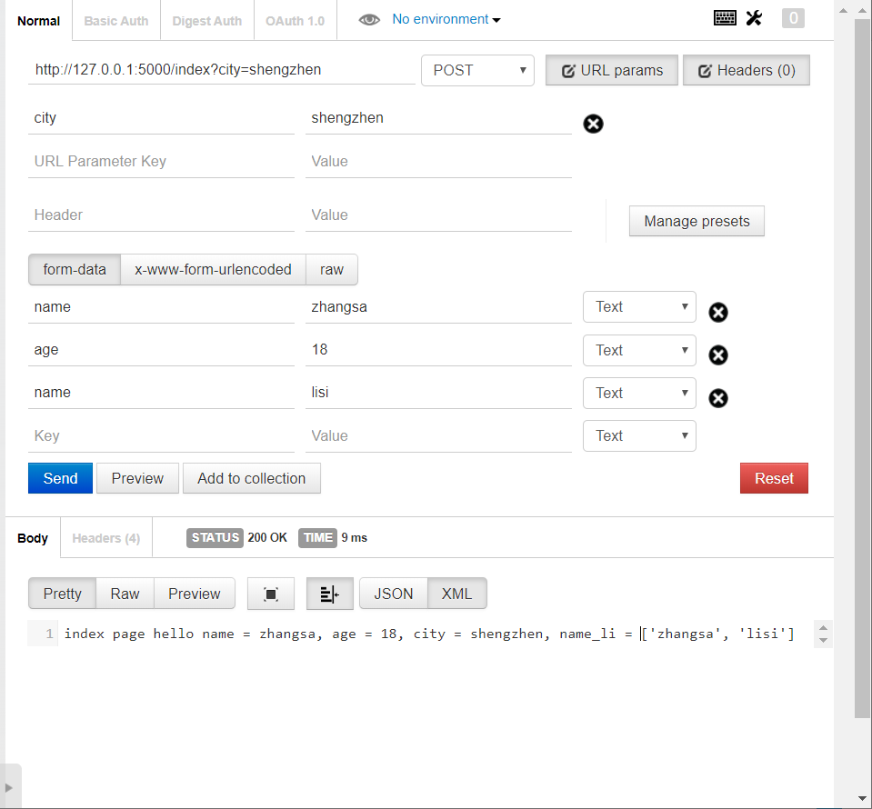

# flask中的request

 主要是了解request中的属性，毕竟request对象中保存了一次HTTP中的所有数据 



这里主要讲解前三个，后面的可以自主学习


### form 表单数据

通过request.form可以直接提取请求体中的表单格式的数据，是一个类字典的对象。例如这样子：

```python
# 这种是一个接口 api
@app.route("/index", methods=["GET", "POST"])
def index():
    # 通过request.form可以直接提取请求体中的表单格式的数据，是一个类字典的对象
    name = request.form.get("name", "zhangsan")  # 设置默认值，如果没有name默认为张三
    age = request.form.get("age")
```

### data 数据

可以使用这个属性提取请求的数据，并转化为字符串

例如我们不像上面那样子发送form数据，我们在postman（一个用于模拟请求的工具）中使用raw类型的来传输数据并且选择json数据格式



例如这样子，那么使用上面的form属性不会获取传入的参数，应该要使用data属性







从里面可以看到，使用form获取的数据返回时得到的参数是None（在上面的postman中可以看到），而且这里使用data获取的数据则成功打印出来，获取成功。

### args 属性

在URL中可以传任何参数，不仅限get请求的参数，也可以是别的请求例如在127.0.0.1:5000/index?city=shengzhen  在？后面的部分叫做“查询字符串”，英文文档中为“QueryString”。这部分可以是request中参数args来提取。


并且这边还有一个点就是，由于数据获取得到格式是类似于Python中的字典格式的，所以我们这里使用get来获得这个参数，注意的是如果有多个同名的参数，那么get方法只能获得第一个，要全部获得需要用到**getlist方法**，然后这边就给出这两个知识点的示例：

```python

# 这种是一个接口 api
@app.route("/index", methods=["GET", "POST"])
def index():
    # request中包含了前端发送过来的所有请求数据
    # form和data是用来提取请求体数据
    # 通过request.form可以直接提取请求体中的表单格式的数据，是一个类字典的对象
    # 通过get方法只能拿到多个同名参数的第一个
    name = request.form.get("name", "zhangsan")  # 设置默认值，如果没有name默认为张三
    age = request.form.get("age")
    name_li = request.form.getlist("name")   # 可以通过getlist提取多个同名的参数
    print(request.data)

    # args是用来提取url中的参数（查询字符串）
    city = request.args.get("city")
    return "index page hello name = %s, age = %s, city = %s, name_li = %s" % (name, age, city, name_li)
```

这边是接口的情况，下面postman发出请求后得到的返回结果



可以看到这里成功获取到查询字符串中的city，而且也可以获取所有name参数。


---


最后还有一个小知识点，就是Python2中的字符串有两种 unicode和str ，这边建议在平时使用的时候出现非英文的时候都加上前缀u

具体知识，看看这篇博客吧

[python2字符串编码问题]( https://www.cnblogs.com/liaohuiqiang/p/7247393.html )


