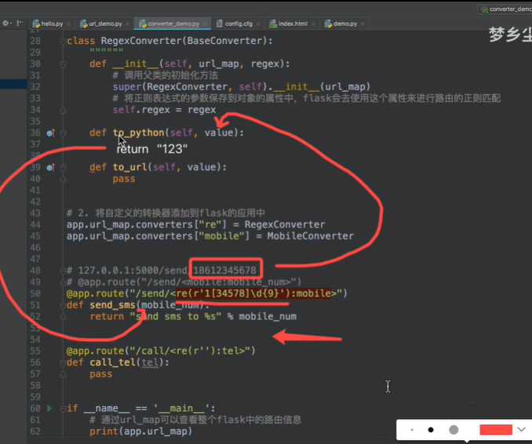
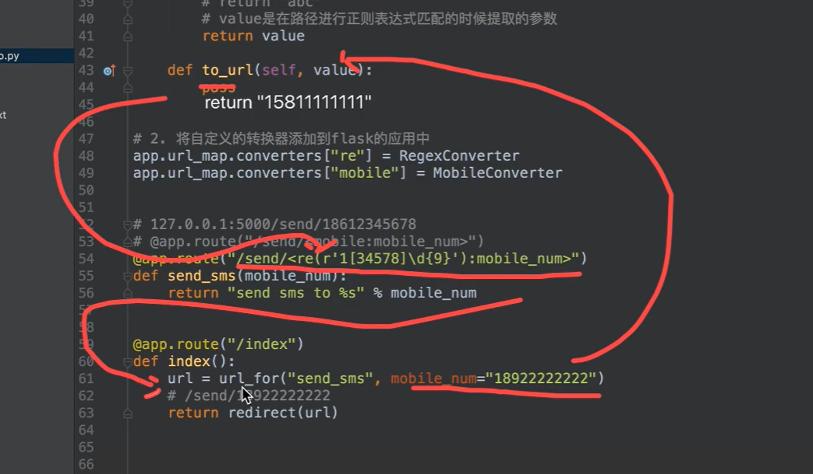

# 转化器

这个转换器是对URL中携带的参数进行规范转换

---

### 首先是自带的转换器

支持类型有三种：

* int
* float
* string

设置方式可以在@app.route中设置，示例：

```python
# 转换器
# http://127.0.0.1:5000/goods/123
# @app.route("/goods/<int:goods_id>")  # 指定url,指定转换器类型为int
@app.route("/goods/<goods_id>")  # 不加转换器类型，默认是普通字符串规则（除了/的字符）
def goods_detail(goods_id):
    """定义视图函数"""
    return "hello goods_id %s" % goods_id
```

---

### 自定义的转换器

支持类型根据自己需求定义。

设置步骤：

* 定义自己的转换器
* 将自定义的转换器添加到flask的应用中

这里需要引入一个模块，基础转换器

```python
from werkzeug.routing import BaseConverter
```

步骤实例：

```python
# 1. 定义自己的转换器
class MobileConverter(BaseConverter):
    """
    这种实现方式只是针对单种转换方式，像这里只针对手机号码
    """
    def __init__(self, url_map):
        super(MobileConverter, self).__init__(url_map)
        self.regex = r'1[34578]\d{9}'  # 这种是写死了
        
 # 2. 将自定义的转换器添加到flask的应用中
app.url_map.converters["mobile"] = MobileConverter
```

通过上面展示的那样基本就是弄好转换器，要使用的时候的操作为：

```python
# 因为我们已经添加到flask应用中了并且添加时key值为mobile，于是这里可以直接使用mobile表示转换器
@app.route("/send/<mobile:mobile_num>")  # 手机号码
def send_sms(mobile_num):
    return "send sms to %s" % mobile_num
```

###### 关于定义自己的转换器

这里有两种方式：

* 按需定义
* 多功能定义


按需定义，也就是针对单个需求进行编写，往往功能单一，不推荐。示例的话也就是上面展示步骤的那个


多功能定义可以对参数有多种转换方式，使得这个转换器的应用场合比较多，转化器的定义如下：

```python
# 自定义转换器
class RegexConverter(BaseConverter):
    """自定义转换器"""
    def __init__(self, url_map, regex):
        # 调用父类的初始化方法
        super(RegexConverter, self).__init__(url_map)
        # 将正则表达式的参数保存到对象的属性中，flask会去使用这个属性来进行路由的正则匹配
        self.regex = regex
        
# 2. 将自定义的转换器添加到flask的应用中
app.url_map.converters["re"] = RegexConverter

# 使用方式
@app.route("/send/<re(r'1[34578]\d{9}'):mobile_num>")  
# 手机号码11位数字，开头1第二位数字在34578选择
def send_sms(mobile_num):
    return "send sms to %s" % mobile_num

@app.route("/cal/re(r'\d{7}'):tel")  # 座机号码，9位
def call_tel(tel):
    pass
```

这里了和上面那个就有一些不同，这里在转换器类中并没有写死转换规则，转化器类中参数只是将正则表达式的参数保存到对象中，而正则表达式的部分部分放在app.route中，这样子就可以根据不同的需求编写规则。

### 关于BaseConverter这个模块

这个模块中还含有另外两个子函数，模块的源码如下：

```python
class BaseConverter(object):
    """Base class for all converters."""

    regex = "[^/]+"
    weight = 100

    def __init__(self, map):
        self.map = map

    def to_python(self, value):
        return value

    def to_url(self, value):
        if isinstance(value, (bytes, bytearray)):
            return _fast_url_quote(value)
        return _fast_url_quote(text_type(value).encode(self.map.charset))
```


##### 关于to_Python函数

这个函数将value值返回给我们的视图函数中，这里要从我们传入这个URL开始讲起。这里先放出讲解例子



当我们在浏览器上输入127.0.0.0.1:5000/send/18612345678, 这个url将进行匹配，send符合，后面的18612345678这串数字也是符合的，于是会保存到对象属性中，进入到to_python函数，将这个值返回给视图函数，这里的重点是**由to_python函数将正则匹配的值返回给视图函数**，所以我们可以在这里做些手脚验证，例如在这里返回123，那么send函数中，接受到这个参数后在网页上呈现的就是“send sms to 123”，无论你输入的是什么手机号码。

**这里要注意这个操作也是会调用到to_url**


##### 关于to_url函数

这个函数在重定位的时候要用到，这里给出讲解例子：



这里index函数是一个重定位的视图函数，这里输入127.0.0.0.1:5000/index，获取路径找到对应的视图函数index进入，在函数中

* 首先通过模块url_for传入跳转的视图函数send_sms以及这个函数所需要的参数

  * 这个过程会利用到to_url函数，正常情况下是返回这个value，我们这里可以修改来验证一下，使其返回一个别的手机号码。

  * 接着，返回的value会传入到send_sms函数上面

    @app.route("/send/<re(r'1[34578]\d{9}'):mobile_num>")

    构造出符合send_sms函数的url

* 于是进行redirect函数，重定位，接着就重复刚才讲to_python的步骤